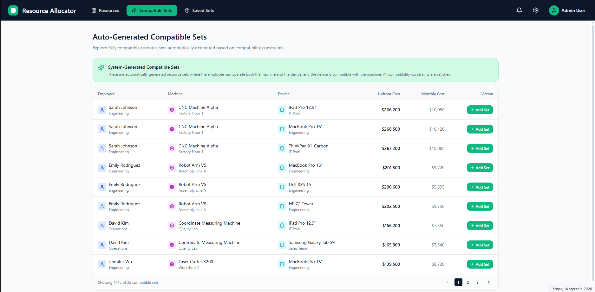

# Resource Planner

## Wprowadzenie
Aplikacja frontendowa do zarządzania i dopasowywania zasobów: maszyn, urządzeń peryferyjnych oraz ludzi. Projekt nie wymaga backendu – dane są zahardkodowane lub generowane losowo. Pozwala na szybkie budowanie zestawów zasobów, analizę kosztów oraz sprawdzanie kompatybilności.

## Opis aplikacji
Aplikacja umożliwia:
- Przeglądanie zasobów według kategorii (maszyny, urządzenia, ludzie)
- Filtrowanie zasobów według kompatybilności i umiejętności
- Tworzenie zestawów zasobów (Resource Set) i ich zapisywanie
- Automatyczne generowanie kompatybilnych zestawów
- Zaawansowane filtrowanie (AND/OR) dla relacji między zasobami
- Podgląd szczegółów zasobu oraz zestawu
- Analizę kosztów (początkowy/miesięczny) dla pojedynczych zasobów i całych zestawów
- Intuicyjny interfejs z panelami bocznymi, dialogami i responsywną siatką kart

### Przykładowe widoki

Poniżej przykładowe zrzuty ekranu z aplikacji (znajdują się w folderze `public/`):

#### Widok główny

#### Zaawansowane filtry

#### Zestawy zasobów

#### Dialog szczegółów

#### Logo

---

## Wymagania funkcjonalne
- Prezentacja trzech typów zasobów:
  - Maszyny (dowolne typy)
  - Urządzenia peryferyjne (kompatybilne tylko z wybranymi maszynami)
  - Ludzie (posiadają umiejętności obsługi konkretnych maszyn i urządzeń)
- Każdy obiekt posiada ikonę.
- Filtrowanie relacji zasobów (kompatybilność / umiejętności).
- Tworzenie poprawnych zestawów: maszyna + urządzenia + ludzie.

### Widoki
- Lista maszyn z filtrowaniem po:
  - kompatybilnych urządzeniach
  - ludziach, którzy mogą je obsługiwać (filtry AND / OR)
- Lista urządzeń z filtrowaniem po:
  - maszynach
  - ludziach (filtry AND / OR)
- Lista ludzi z filtrowaniem po:
  - maszynach
  - urządzeniach (filtry AND / OR)
- Dedykowany widok do UX-owego łączenia zasobów w zestawy.

### Bonusy
- Koszty: każdy zasób ma koszt początkowy i miesięczny; zestawy można dodawać do listy, a panel boczny pokazuje sumy kosztów.
- Automatycznie generowane zestawy zgodne z regułami kompatybilności.

## Wymagania niefunkcjonalne
- Brak backendu
- Estetyczny, spójny UI
- Przemyślany UX

## Technologie
- Angular lub React (do wyboru)

## Licencje

This project Includes photos from [Unsplash](https://unsplash.com) used under [license](https://unsplash.com/license).
and components from [shadcn/ui](https://ui.shadcn.com/) used under [MIT license](https://github.com/shadcn-ui/ui/blob/main/LICENSE.md).
---
Ten plik README.md zawiera wymagania projektowe, do których Copilot będzie się odnosił podczas pracy nad projektem.